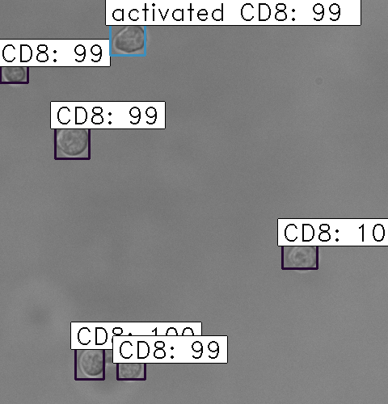
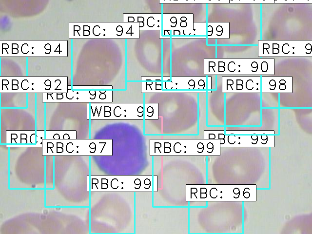
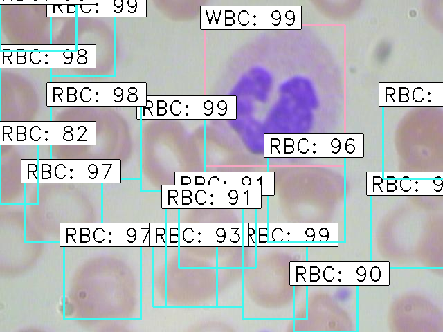

# keras-frcnn
Keras implementation of Faster R-CNN: Towards Real-Time Object Detection with Region Proposal Networks.
cloned from https://github.com/yhenon/keras-frcnn/

USAGE:
- Both theano and tensorflow backends are supported. However compile times are very high in theano, and tensorflow is highly recommended.
- `train_frcnn.py` can be used to train a model. To train on Pascal VOC data, simply do:
`python train_frcnn.py -p /path/to/pascalvoc/`. 
- the Pascal VOC data set (images and annotations for bounding boxes around the classified objects) can be obtained from: http://host.robots.ox.ac.uk/pascal/VOC/voc2012/VOCtrainval_11-May-2012.tar
- simple_parser.py provides an alternative way to input data, using a text file. Simply provide a text file, with each
line containing:

    `filepath,x1,y1,x2,y2,class_name`

    For example:

    /data/imgs/img_001.jpg,837,346,981,456,cow
    
    /data/imgs/img_002.jpg,215,312,279,391,cat

    The classes will be inferred from the file. To use the simple parser instead of the default pascal voc style parser,
    use the command line option `-o simple`. For example `python train_frcnn.py -o simple -p my_data.txt`.

- Running `train_frcnn.py` will write weights to disk to an hdf5 file, as well as all the setting of the training run to a `pickle` file. These
settings can then be loaded by `test_frcnn.py` for any testing.

- test_frcnn.py can be used to perform inference, given pretrained weights and a config file. Specify a path to the folder containing
images:
    `python test_frcnn.py -p /path/to/test_data/`
- Data augmentation can be applied by specifying `--hf` for horizontal flips, `--vf` for vertical flips and `--rot` for 90 degree rotations

NOTES:
- config.py contains all settings for the train or test run. The default settings match those in the original Faster-RCNN
paper. The anchor box sizes are [128, 256, 512] and the ratios are [1:1, 1:2, 2:1].

- For the T-cell (CD8) detection case, use anchor box sizes are [16, 32, 64] since the cell size is about 30 pixels, and images are about 480x480 pixels, use resize parameter im_size=900 

- For the Red Blood Cell (RBC) and platelet detection case, use the default anchor box size and im_size parameter

- The theano backend by default uses a 7x7 pooling region, instead of 14x14 as in the frcnn paper. This cuts down compiling time slightly.
- The tensorflow backend performs a resize on the pooling region, instead of max pooling. This is much more efficient and has little impact on results.

Example output:

ISSUES:

- If you get this error:
`ValueError: There is a negative shape in the graph!`    
    than update keras to the newest version

- This repo was developed using `python2`. `python3` should work thanks to the contribution of a number of users.

- If you run out of memory, try reducing the number of ROIs that are processed simultaneously. Try passing a lower `-n` to `train_frcnn.py`. Alternatively, try reducing the image size from the default value of 600 (this setting is found in `config.py`.
